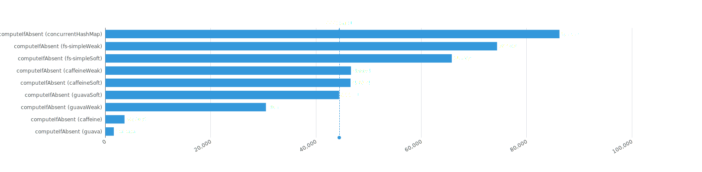
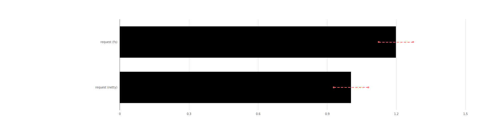

#  _fs_: a lightweight, zero-dependency tool lib for java

## Overview

_fs_ is a lightweight, high-performance, zero-dependency tool lib for java. It provides:

- Annotations that can be used for code analysis;
- Common utilities for bytes, chars, coding, date, enum, logging, math, number, thread, process, system, random,
  reflect, etc.;
- Extensions for functions and values;
- Common exceptions;
- I/O kits and interfaces;
- Cache kits;
- Operations for collections, maps, arrays, etc.;
- Operations for codec;
- Concurrent supports;
- Net kits for http, tcp, udp, etc.;
- Object parsing and conversion;
- Invocation kits, supporting reflection, method-handle and [asm](https://asm.ow2.io);
- Proxy and aspect, supporting JDK dynamic proxy and [asm](https://asm.ow2.io);
- Third-party supporting: [asm](https://asm.ow2.io), [protobuf](https://github.com/protocolbuffers/protobuf);

## Multi-Version JDK Support

_fs_ provides adaptive implementation loading that automatically selects the optimal class version based on the runtime
JDK environment (from Java 8 to Java 17). Its main code is based on Java 8, but some interfaces have multiple
implementation classes of different jdk versions. For example, the implementation class of
`space.sunqian.common.net.http.HttpCaller` has two versions:
`of JDK8` and `of JDK11`. The former is based on `java.net.HttpURLConnection`, and the latter is based on
`java.net.http.HttpClient`.

This ensures:

- **Backward Compatibility**: Seamlessly runs on older JDK versions (Java 8+);
- **Forward Optimization**: Leverages newer JDK features when available (up to Java 17);
- **Automatic Detection**: No manual configuration required -- the library automatically loads the appropriate
  implementation at runtime;

## High Performance

_fs_ has higher performance than other common libraries in many places, Here are some examples:

- **Simple Cache** (`space.sunqian.common.cache.SimpleCache`):
  SimpleCache only considers common cache functions, so it has higher performance in common functions:

  

- **CopyProperties** (`Fs.copyProperties / space.sunqian.common.object.convert.DataMapper`):
  DataMapper has better performance and more comprehensive support:

  

- **TCP Server** (`space.sunqian.common.net.tcp.TcpServer`):
  Rare interface server implementation with slightly better performance than **netty**:

  

## Test passing rate and coverage: 100%

The test passing rate and coverage for this library are both 100%. (coverage tool: jacoco)

## Samples:

- [Annotations](./fs-tests/src/main/java/internal/samples/AnnotationSample.java)
- [Simple Cache](./fs-tests/src/main/java/internal/samples/CacheSample.java)
- [Dependency Injection](./fs-tests/src/main/java/internal/samples/DISample.java)
- [Proxy and Aspect](./fs-tests/src/main/java/internal/samples/ProxyAndAspectSample.java)
- [Object Conversion](./fs-tests/src/main/java/internal/samples/ObjectSamples.java)
- [Net](./fs-tests/src/main/java/internal/samples/NetSample.java)
- [Other samples](./fs-tests/src/main/java/internal/samples/OtherSamples.java)

## Clone

```shell
# clone and build
git clone -b master https://github.com/fredsuvn/fs.git
cd fs && gradle clean build
```

## Documents

- javadoc:
  * javadoc: [index.html](docs/javadoc/index.html)
- manuals:
  * develop manual: [dev-manual.adoc](docs/dev-manual.adoc)
- benchmarks:
  * visualizer: [jmh.html](docs/jmh/jmh.html)
  * json: [results.json](docs/jmh/results.json)

## Contact

* github: [https://github.com/fredsuvn](https://github.com/fredsuvn)
* QQ group: [566185308](https://qm.qq.com/q/wlkc2tmOaG)

## License

[Apache 2.0 license][license]

[license]: https://www.apache.org/licenses/LICENSE-2.0.html